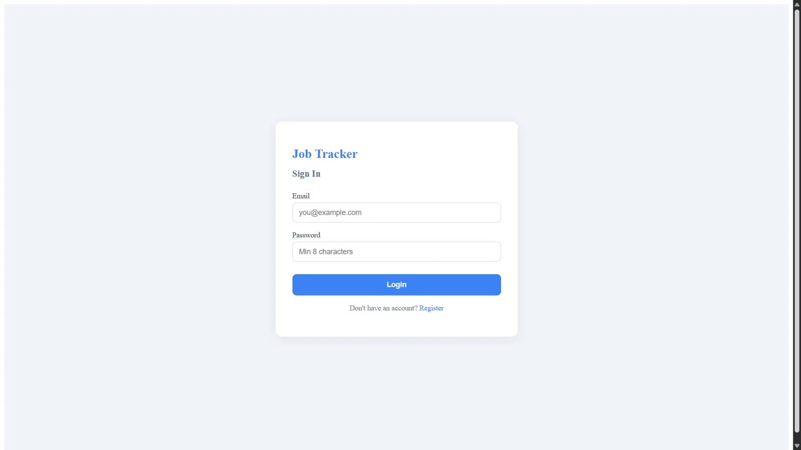
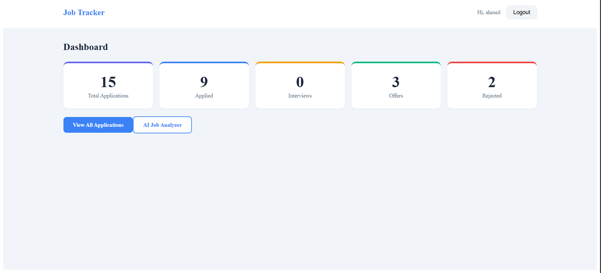
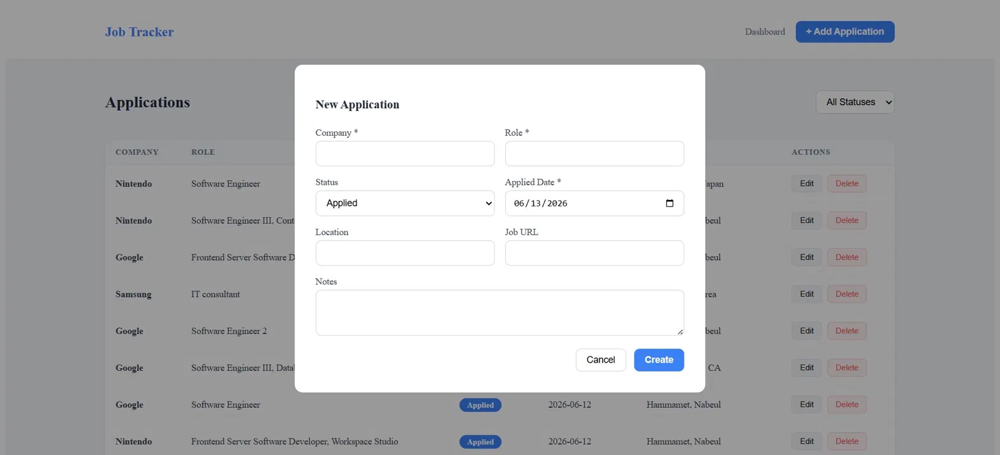
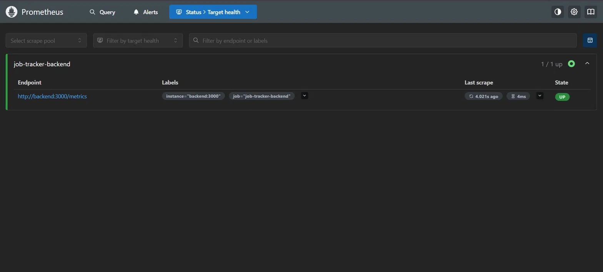
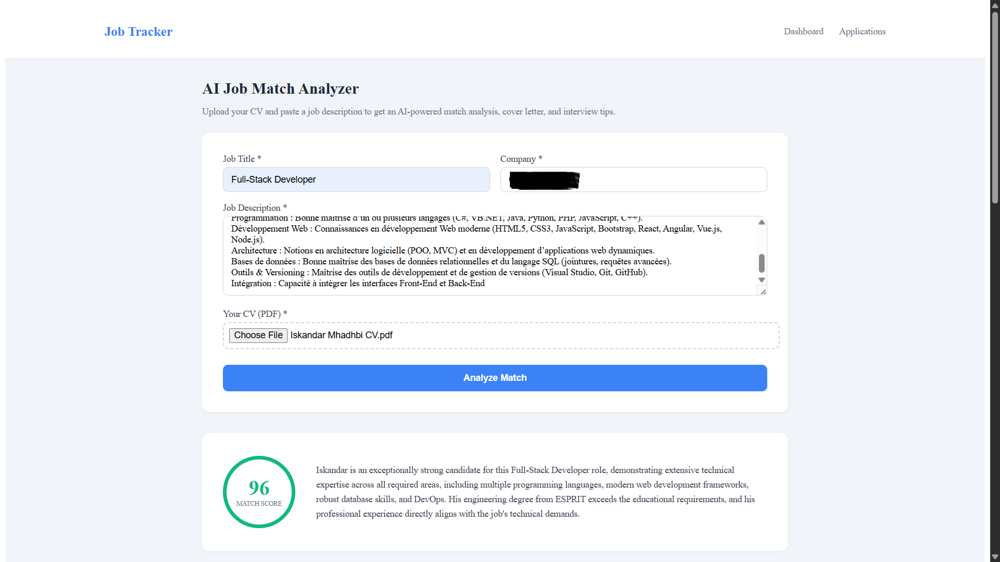
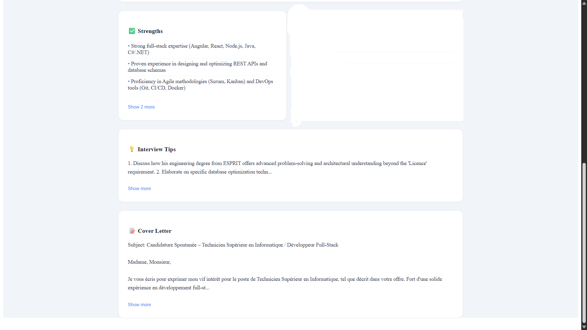

# Job Tracker


A full-stack job application tracker to manage your job search from application to offer. Built with a production-grade stack including CI/CD, containerization, and real-time monitoring.

---
## Table of Contents

- [Features](#features)
- [Screenshots](#screenshots)
- [Architecture](#architecture)
- [Tech Stack](#tech-stack)
- [Getting Started](#getting-started)
- [API Endpoints](#api-endpoints)
- [Testing](#testing)
- [CI/CD Pipeline](#cicd-pipeline)
- [Monitoring](#monitoring)
- [Project Structure](#project-structure)
- [Future Improvements](#future-improvements)

---

## Features

- **Application Management** — Create, edit, delete job applications with full details
- **Status Pipeline** — Track progress: Applied → Interview → Offer / Rejected / Withdrawn
- **Dashboard** — Visual overview of your application pipeline with live stats
- **Filter by Status** — Quickly find applications by stage
- **Follow-up Dates** — Never miss a follow-up
- **JWT Authentication** — Secure per-user data with token-based auth
- **REST API** — Clean, documented endpoints with validation
- **Monitoring** — Prometheus metrics + Grafana dashboards
- **AI Job Match Analyzer** — Upload your CV and a job description to get an AI-powered match score, cover letter, missing skills analysis, and interview tips powered by Google Gemini
- **Event-Driven Architecture** — Application status changes trigger AWS EventBridge events, invoking a Lambda function that logs notifications to S3
- **AWS S3** — CV files uploaded during AI analysis are stored in S3

---

## Screenshots

### Login


### Dashboard


### Applications


### Add Application


### Prometheus Monitoring


### AI Job Match Analyzer


---

## Architecture
┌─────────────┐     HTTP      ┌─────────────────┐     TypeORM    ┌──────────────┐

│   Angular   │ ────────────► │    NestJS API    │ ─────────────► │  PostgreSQL  │

│  Frontend   │               │   (Port 3000)    │                │  (Port 5432) │

└─────────────┘               └─────────────────┘                └──────────────┘

│

│ /metrics

▼

┌──────────────┐        ┌─────────────┐

│  Prometheus  │ ──────► │   Grafana   │

│  (Port 9090) │         │ (Port 3001) │

└──────────────┘         └─────────────┘

---

## Tech Stack

| Layer | Technology |
|-------|------------|
| Frontend | Angular 22, RxJS, SCSS |
| Backend | NestJS 11, TypeORM, Passport JWT |
| Database | PostgreSQL 15 |
| Monitoring | Prometheus, Grafana |
| Infrastructure | Docker, Docker Compose |
| CI/CD | GitHub Actions |
| Testing | Jest (unit tests) |
| AI | Google Gemini API |
| AWS (LocalStack) | S3, EventBridge, Lambda, IAM |

---

## Getting Started

### Prerequisites

- [Node.js](https://nodejs.org) 20+
- [Docker Desktop](https://www.docker.com/products/docker-desktop)

### Option A — Full Docker Setup (recommended)

```bash
# Clone the repo
git clone https://github.com/Iskandar-Mhadhbi/job-tracker.git
cd job-tracker

# Copy and configure environment
cp backend/.env.example backend/.env

# Start everything
docker-compose up -d
```

| Service | URL |
|---------|-----|
| Frontend | http://localhost:4200 |
| Backend API | http://localhost:3000/api |
| Prometheus | http://localhost:9090 |
| Grafana | http://localhost:3001 |

Grafana default credentials: `admin` / `admin`

### Option B — Local Development

**Backend:**
```bash
cd backend
cp .env.example .env
npm install
npm run start:dev
```

**Frontend:**
```bash
cd frontend
npm install
ng serve
```

> Make sure Docker is running for PostgreSQL:
> ```bash
> docker-compose up postgres -d
> ```

---

## API Endpoints

### Auth
| Method | Endpoint | Description | Auth |
|--------|----------|-------------|------|
| POST | `/api/auth/register` | Register new user | ❌ |
| POST | `/api/auth/login` | Login | ❌ |
| GET | `/api/auth/profile` | Get current user | ✅ |

### Applications
| Method | Endpoint | Description | Auth |
|--------|----------|-------------|------|
| GET | `/api/applications` | List all applications | ✅ |
| GET | `/api/applications?status=interview` | Filter by status | ✅ |
| GET | `/api/applications/stats` | Get pipeline stats | ✅ |
| POST | `/api/applications` | Create application | ✅ |
| PATCH | `/api/applications/:id` | Update application | ✅ |
| DELETE | `/api/applications/:id` | Delete application | ✅ |

### Monitoring
| Method | Endpoint | Description |
|--------|----------|-------------|
| GET | `/metrics` | Prometheus metrics |

---

## Testing

```bash
cd backend

# Run unit tests
npm test

# Run with coverage report
npm run test:cov
```

Coverage report generated at `backend/coverage/lcov-report/index.html`

**Test suites:** 2 | **Tests:** 15 | **Coverage:** Services 96-100%

---

## CI/CD Pipeline

Every push to `develop` or `main` triggers:

1. **Tests & Coverage** — Jest unit tests with HTML coverage report uploaded as artifact
2. **Build Backend Image** — Docker image built, pushed to GHCR on merge to `main`
3. **Build Frontend Image** — Docker image built, pushed to GHCR on merge to `main`

---

## Monitoring

Prometheus scrapes metrics from the backend every 15 seconds. Access Grafana at `http://localhost:3001` to visualize:

- HTTP request rates
- Node.js heap memory usage
- CPU usage
- Active connections

To add a dashboard in Grafana:
1. Login at `http://localhost:3001` with `admin/admin`
2. Add data source → Prometheus → `http://prometheus:9090`
3. Import dashboard ID `11159` (Node.js Application Dashboard)

---

## Project Structure

job-tracker/

├── backend/                 # NestJS API

│   └── src/

│       ├── applications/    # Applications CRUD module

│       ├── auth/            # JWT authentication module

│       ├── config/          # Environment configuration

│       ├── metrics/         # Prometheus metrics module

│       └── main.ts

├── frontend/                # Angular SPA

│   └── src/app/

│       ├── pages/           # Dashboard, Applications, Login

│       ├── services/        # HTTP services

│       ├── guards/          # Auth guard

│       └── models/          # TypeScript interfaces

├── monitoring/

│   └── prometheus.yml       # Prometheus scrape config

├── .github/workflows/       # CI/CD pipeline

├── infrastructure/
│   ├── localstack/init/    # AWS resource provisioning scripts
│   └── lambdas/            # Lambda function code

└── docker-compose.yml       # Full stack orchestration

---

## Future Improvements

- [ ] Deploy to Railway/Render with full CD pipeline
- [ ] API versioning (`/api/v1/`)
- [ ] Semantic versioning with conventional commits
- [ ] Build artifacts published to GitHub Container Registry on release
- [ ] E2E tests with Playwright
- [ ] Email notifications for follow-up dates
- [ ] Export applications to CSV
- [ ] Save AI analysis results directly as a new application
- [ ] Support multiple CV formats (DOCX, TXT)
- [ ] Deploy to real AWS (S3, EventBridge, Lambda, RDS Aurora)
- [ ] CloudWatch logging and alerting
- [ ] WebSocket notifications when Lambda processes status changes

---

## License

MIT © [Iskandar Mhadhbi](https://github.com/Iskandar-Mhadhbi/job-tracker)